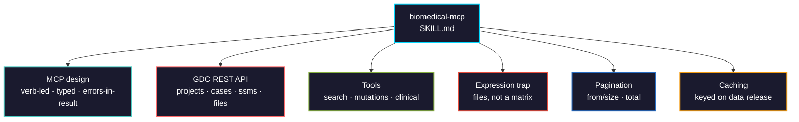

# biomedical-mcp

Building Model Context Protocol servers that give AI agents structured, tested access to biomedical databases: MCP tool design, the GDC REST API behind TCGA, pagination and caching, and the data-shape traps that make a naive wrapper wrong.

> **Part 1 of a multi-part skill.** TCGA/GDC. GEO and biomarker databases follow.



## Usage

```bash
pip install biomedical-ai-skills
biomedical-skills install biomedical-mcp
```

## The one that catches everyone

**There is no `get_expression_matrix`.** Querying the GDC for expression returns **~28,000 downloadable file references**, not numbers. You POST the `file_id`s to `/data/{id}`, download one tab-separated file per sample, and assemble the matrix yourself. A tool that promises a matrix from one call cannot deliver, and the agent will build on the false promise. (Verified against Data Release 46.0: 28,315 expression files.)

## What it gets right that is easy to get wrong

| | |
|---|---|
| `mcp` 2.0 import | Server class is `MCPServer` from `mcp.server`. The `FastMCP` import is the 1.x line |
| Expression | Returns **file references**, not a matrix. Download from `/data/{file_id}` and assemble |
| Clinical `expand` | `vital_status`, age, `days_to_death` need `expand=demographic,diagnoses`, else cases come back near-empty |
| `ssms` vs `ssm_occurrences` | Distinct mutations vs mutation-in-a-case. A cohort count is almost always the occurrence count |
| Pagination | `from`/`size` offsets, not page numbers. Response carries `pagination.total` |
| `primary_site` | A **list** (`['Bronchus and lung']`), not a string — even when it looks scalar |
| TCGAbiolinks | It's **R**. A Python server calls the GDC REST API directly — which is what TCGAbiolinks calls anyway |
| Tool naming | Service-prefixed, verb-led (`tcga_get_mutations`), or it collides with every other loaded server |
| Errors | Return a structured error **in the result**, not a raised exception the agent sees as a dead tool |
| Data release | `/status` gives it. Cache and cite it, or a reproduction silently drifts |

## Verified against the live GDC API (Data Release 46.0, 2026-08)

| Query | Result |
|---|---|
| projects, `'lung'` filter | `TCGA-LUAD`, ALCHEMIST-ALCH, MATCH-S1 |
| mutations, TCGA-LUAD + KRAS | 14 distinct mutations |
| clinical, TCGA-LUAD + `expand` | demographic present with `vital_status` |
| expression files | **28,315** file references, no inline values |

The four tool bodies in the skill were executed against the live API; all returned the documented shapes.

## Tool landscape (2026-08)

| Use | Tool | Status |
|-----|------|--------|
| MCP server SDK | `mcp` 2.0.0 (`mcp[cli]`) | current; `MCPServer` API, major bump from 1.x |
| Alternative SDK | `fastmcp` 3.4.7 | standalone FastMCP |
| HTTP client | `httpx` | async-capable |
| TCGA data (R) | `TCGAbiolinks` | Bioconductor; wraps the same GDC API |
