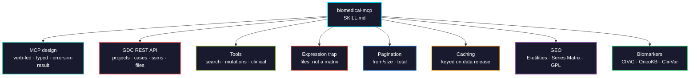

# biomedical-mcp

Building Model Context Protocol servers that give AI agents structured, tested access to biomedical databases: MCP tool design, the GDC REST API behind TCGA, GEO search and Series Matrix retrieval, aggregating the CIViC, OncoKB and ClinVar biomarker databases, pagination and caching, and the data-shape traps that make a naive wrapper wrong.

> **Complete skill**, validated. TCGA/GDC, GEO, the CIViC/OncoKB/ClinVar biomarker databases, and a live-API integration suite.



## Usage

```bash
pip install biomedical-ai-skills
biomedical-skills install biomedical-mcp
```

## The one that catches everyone

**There is no `get_expression_matrix`.** Querying the GDC for expression returns **~28,000 downloadable file references**, not numbers. You POST the `file_id`s to `/data/{id}`, download one tab-separated file per sample, and assemble the matrix yourself. A tool that promises a matrix from one call cannot deliver, and the agent will build on the false promise. (Verified against Data Release 46.0: 28,315 expression files.)

## What it gets right that is easy to get wrong

| | |
|---|---|
| `mcp` 2.0 import | Server class is `MCPServer` from `mcp.server`. The `FastMCP` import is the 1.x line |
| Expression | Returns **file references**, not a matrix. Download from `/data/{file_id}` and assemble |
| Clinical `expand` | `vital_status`, age, `days_to_death` need `expand=demographic,diagnoses`, else cases come back near-empty |
| `ssms` vs `ssm_occurrences` | Distinct mutations vs mutation-in-a-case. A cohort count is almost always the occurrence count |
| Pagination | `from`/`size` offsets, not page numbers. Response carries `pagination.total` |
| `primary_site` | A **list** (`['Bronchus and lung']`), not a string — even when it looks scalar |
| TCGAbiolinks | It's **R**. A Python server calls the GDC REST API directly — which is what TCGAbiolinks calls anyway |
| Tool naming | Service-prefixed, verb-led (`tcga_get_mutations`), or it collides with every other loaded server |
| Errors | Return a structured error **in the result**, not a raised exception the agent sees as a dead tool |
| Data release | `/status` gives it. Cache and cite it, or a reproduction silently drifts |
| GEO expression | Values are a **Series Matrix on the FTP**, not from the search API. Array matrices are real tables; RNA-seq usually isn't |
| GEO probe rows | A Series Matrix is indexed by **probe** (`1007_s_at`), not gene. Map through the GPL platform table |
| GEO `gds` UID | UID `200002034` is **GSE2034**. The FTP has never heard of the UID; convert it |
| Series Matrix path | Last three digits of the GSE become `nnn`: `GSE2034` → `GSE2nnn/GSE2034/matrix/` |
| E-utilities limits | **3 req/sec** without a key, 10 with. Pass `tool=` and `email=` |
| GEOquery | It's **R**. A Python server uses GEOparse/geofetch or the FTP directly |
| Three biomarker DBs | **CIViC** open GraphQL, **OncoKB** token-gated REST (non-commercial, 401 without a token), **ClinVar** open E-utilities. No uniform client |
| CIViC evidence | Attaches to a **molecular profile**, not a variant. `evidenceItems(variantId:)` agrees for simple variants but drops the compound condition — keep the profile name |
| Variant nomenclature | `V600E` (CIViC/OncoKB) vs `NM_004333.6(BRAF):c.1799T>A (p.Val600Glu)` (ClinVar). Reconcile on HGVS/coordinates, not display names |
| Evidence levels | CIViC A–E, OncoKB 1–4/R1–R2, ClinVar gold stars. **Not one scale** — keep per-source |
| ClinVar classification | Predominantly **germline** pathogenicity, not somatic actionability. A germline "Pathogenic" is not a drug indication |
| OncoKB token | Per-user, non-commercial. Read from the environment, never commit |

## Verified against the live GDC API (Data Release 46.0, 2026-08)

| Query | Result |
|---|---|
| projects, `'lung'` filter | `TCGA-LUAD`, ALCHEMIST-ALCH, MATCH-S1 |
| mutations, TCGA-LUAD + KRAS | 14 distinct mutations |
| clinical, TCGA-LUAD + `expand` | demographic present with `vital_status` |
| expression files | **28,315** file references, no inline values |

The four tool bodies in the skill were executed against the live API; all returned the documented shapes.

## GEO tools verified against the live NCBI API and FTP (2026-08)

| Check | Result |
|---|---|
| `gds` search, breast cancer arrays | UIDs returned, esummary gives accession/GPL/n_samples |
| UID → accession | `200002034` → **GSE2034** |
| Series Matrix path rule | `GSE2034` → `GSE2nnn/GSE2034/matrix/` |
| parse GSE2034 array matrix | **22,283 probe rows**, first probe `1007_s_at` |

Six GEO checks, all passing: search, summary, UID conversion, path computation, download, and parse.

## Validation

Tests in [`tests/`](tests/) are live-API integration checks: they confirm the documented contracts still hold against the GDC, GEO/E-utilities, CIViC, OncoKB and ClinVar services, so the tool code stays correct as those APIs evolve. `urllib` only, no dependency; each suite skips cleanly offline.

**Executed 2026-08-25: 27 assertions, 0 failures** (Python 3.13.5, GDC Data Release 46.0).

```bash
cd tests && python run_all.py
```

| Suite | Assertions | Confirms |
|---|---|---|
| gdc | 11 | `expand` required for clinical, `from`/`size` pagination, expression is file references, `primary_site` is a list |
| geo | 8 | UID→accession, Series Matrix path rule, array matrix is a probe-indexed value table |
| biomarker | 8 | CIViC evidence paths agree 12/12, V600E PREDICTIVE via molecular profile, OncoKB 401 without a token, ClinVar germline classification |

## Biomarker tools verified against the live CIViC, OncoKB, and ClinVar APIs (2026-08)

| Check | Result |
|---|---|
| CIViC `browseVariants` (BRAF) | variants with `evidenceItemCount`, `therapies` |
| CIViC evidence paths | `evidenceItems(variantId:)` agrees with `molecularProfiles` for **12/12** BRAF variants |
| CIViC V600E evidence | PREDICTIVE / level B / SENSITIVITYRESPONSE / Dabrafenib, Trametinib (via molecular profile) |
| OncoKB without a token | **HTTP 401** — degrade, do not crash |
| ClinVar V600E | germline classification returned (e.g. "drug response") |

Six biomarker checks, all passing. This part also **corrected an earlier draft claim**: `evidenceItems(variantId:)` does *not* universally return zero — it agrees with the molecular-profile path for simple variants. The real reason to use the profile is to keep the compound-condition context, not because the variant path is empty.

## Tool landscape (2026-08)

| Use | Tool | Status |
|-----|------|--------|
| MCP server SDK | `mcp` 2.0.0 (`mcp[cli]`) | current; `MCPServer` API, major bump from 1.x |
| Alternative SDK | `fastmcp` 3.4.7 | standalone FastMCP |
| HTTP client | `httpx` | async-capable |
| TCGA data (R) | `TCGAbiolinks` | Bioconductor; wraps the same GDC API |
| GEO search | NCBI E-utilities (`gds` db) | open; 3 req/sec, 10 with an API key |
| GEO data (R) | `GEOquery` 2.81.x | Bioconductor; the reference implementation |
| GEO data (Python) | `GEOparse` 2.0.4 / `geofetch` 0.12.11 | no R needed |
| Clinical evidence | CIViC GraphQL | open, no auth |
| Precision oncology | OncoKB REST | **token required**; free for research, non-commercial |
| Variant classification | ClinVar (`db=clinvar`) | open, E-utilities |
