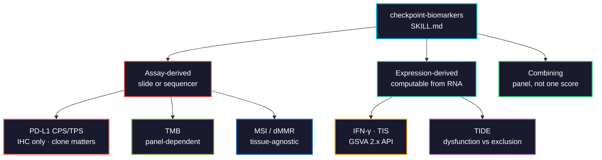

# checkpoint-biomarkers

Predictive biomarkers for immune checkpoint blockade: PD-L1 IHC scoring and why expression cannot produce it, TMB, MSI, and the expression signatures (IFN-γ, TIS, TIDE) that RNA *can* give you.



## Usage

```bash
pip install biomedical-ai-skills
biomedical-skills install checkpoint-biomarkers
```

## The correction this skill leads with

**CPS and TPS cannot be computed from expression data.** They are counts of individual stained cells on an IHC slide, and CPS additionally requires telling a stained tumour cell apart from a stained lymphocyte or macrophage — a morphological judgement at cellular resolution.

```
TPS = (PD-L1-stained viable tumour cells / total viable tumour cells) × 100
CPS = (stained tumour cells + lymphocytes + macrophages
       / total viable tumour cells) × 100
```

Bulk RNA gives one `CD274` value per sample. It has no cells in it, so it cannot enumerate them or assign them to a compartment. `CD274` mRNA correlates with PD-L1 IHC — reasonably well — but a correlation is not a score, and a "CPS estimated from expression" has no clinical or regulatory meaning. Report `CD274` as its own variable, or obtain a scored slide.

## What it gets right that is easy to get wrong

| | |
|---|---|
| CPS / TPS | **IHC only.** Not derivable from RNA at any quality of correlation |
| PD-L1 assays | 22C3, 28-8, SP142, SP263 are **not interchangeable**. SP142 stains fewer cells, so the same sample flips between assays |
| "PD-L1 positive" | Meaningless without **clone + scoring system + cutoff** |
| TMB across assays | Numerator rules, capture size and germline filtering differ by vendor |
| TMB at 10 mut/Mb | On a 0.8 Mb panel that is ~8 observed mutations. The interval is wide and rarely shown |
| MSI reporting | Give unstable loci **over loci examined**. 20% of 15 ≠ 20% of 2,000 |
| MSI-high vs TMB-high | Overlapping, **not identical**. Smoking and UV reach TMB-high with intact MMR |
| GSVA 2.x | Parameter objects (`ssgseaParam()`). The 1.x `gsva(expr, gsets, method=)` call **no longer exists** |
| Mean-of-z scoring | Defined relative to the cohort present when computed. Adding samples silently changes earlier scores |
| TIDE input | Expects expression normalized against a control cohort. Raw TPM gives plausible, meaningless scores |
| TIDE access | The web tool returns **HTTP 403** to programmatic requests; use `tidepy` |
| IFN-γ + TIS | Overlap by construction — not independent evidence |
| Composite scores | Biomarkers disagree by design. A single "immunotherapy score" needs external validation almost none have |

## Validation

Tests in [`tests/`](tests/) measure the cohort-dependence claim directly.

**Executed 2026-08-30: 9 assertions, 0 failures** (Python 3.13.5). Synthetic, fixed seed, no download.

Scores for the **same first 20 samples** after adding 10 more:

| Scoring method | max \|change\| |
|---|---|
| mean-of-z | **0.5285** |
| rank-based single-sample | **0.0000** |

Recomputing a mean-of-z signature after accrual silently rewrites every earlier score.

## Verified 2026-08

| Tool | Version | Note |
|---|---|---|
| `GSVA` | 2.6.6 (Bioconductor) | **breaking API change** — `gsvaParam`, `ssgseaParam`, `zscoreParam`, `plageParam` |
| `singscore` | 1.32.0 (Bioconductor) | rank-based, explicitly single-sample |
| `tidepy` | 1.3.9 (PyPI) | programmatic TIDE; the web tool 403s |

Confirmed from the GSVA source that the only `gsva` method dispatches on `signature(param="gsvaParam")` — GSVA 1.x code will not run.
