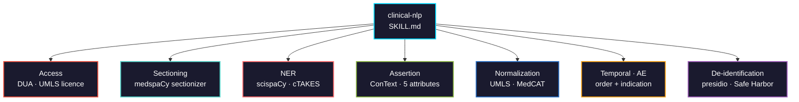

# clinical-nlp

Information extraction from clinical free text: sectioning, biomedical NER, concept normalization to UMLS and ICD-10, assertion and negation detection, temporal relations, adverse events, and de-identification.



## Usage

```bash
pip install biomedical-ai-skills
biomedical-skills install clinical-nlp
```

## The access question comes before the code

| Corpus | Gate |
|---|---|
| PubMed abstracts, BC5CDR, NCBI-Disease, MedMentions | open |
| MIMIC-IV-Note | PhysioNet credentialing: CITI training + signed DUA |
| n2c2 / i2b2 | separate DUA through the hosting institution |
| UMLS Metathesaurus | free but licensed; no package ships it |

Sending credentialed note text to a hosted API is a DUA breach, not a grey area. Run models locally on that text, and keep note text out of version control entirely.

## What it gets right that is easy to get wrong

| | |
|---|---|
| `is_negated` alone | Catches "no pneumonia", misses "**mother** had breast cancer" and "**if** the patient develops sepsis". All **five** ConText attributes must be False |
| Sectioning | "colon cancer" under *Family History* is not a patient diagnosis. Section before filtering |
| scispaCy model URL | Package is **0.6.2**, models stop at **0.5.4**. Building the URL from the package version 404s |
| `numpy<2.0` | scispaCy pins it, plus `python<3.13`. Give it its own environment — do not downgrade numpy in a shared one |
| medspaCy + negspacy | spaCy pins are **disjoint** on Python < 3.12. Use medspaCy's ConText |
| `linker_name` | Has **no default**. Omitting it does not silently pick UMLS |
| `kb_ents[0]` | A ranked candidate list, not an answer. The top hit can score barely above the 0.7 threshold |
| `en_core_sci_*` | Finds spans **without typing them**. Typed entities need an `en_ner_*` model |
| `filter_for_definitions` | Defaults `True` and silently drops concepts lacking definition text |
| ICD-10 output | Coding depends on documentation and payer rules the text does not determine. Ship ranked candidates with evidence spans |
| Adverse events | Drug + symptom in one note is co-occurrence. Metformin and hyperglycaemia co-occur with causality **reversed** |
| MIMIC evaluation | Bio_ClinicalBERT was pretrained on MIMIC notes, so a MIMIC test set overlaps pretraining |
| Automated de-identification | Safe Harbor is **categorical** — one surviving name fails it. A first pass before human review, not compliance |

## Validation

Tests in [`tests/`](tests/) use only synthetic text — no corpus download, no credentialed data. scispaCy is deliberately avoided (its `numpy<2.0` pin blocks a current stack); its constraints are verified from PyPI metadata instead.

**Executed 2026-08-22: 45 assertions, 0 failures** (Python 3.13.5, medspaCy 1.3.1, spaCy 3.8.15, Presidio 2.2.364).

```bash
cd tests && python run_all.py
```

The central result, on a four-entity synthetic note:

| Check | Findings reported |
|---|---|
| naive — `is_negated` only | **3** |
| correct — all five attributes | **0** |

The three spurious ones are a father's colon cancer, a resolved 2020 pneumonia, and a penicillin allergy.

Two gaps the suite documents — both return all five attributes False, so both read as active findings:

```
"Patient at risk for stroke."
"Status post MI in 2019."
```

It also corrected the skill: **`rule out X` sets `is_uncertain`, not `is_hypothetical`.** Only an if-construction is hypothetical. The original text had that backwards.

And it pins Presidio's clinical behaviour: `MRN 00123456` is typed `US_BANK_NUMBER`/`US_DRIVER_LICENSE`, a specimen accession is typed `US_DRIVER_LICENSE`, and a bare `555-0142` is missed entirely.

## Dependency conflicts, verified 2026-08

```
scispacy 0.6.2   spacy>=3.7,<3.9   numpy<2.0   python<3.13
medspacy 1.3.1   spacy<3.8 (py<3.12)   spacy>=3.8,<4.0 (py>=3.12)
negspacy 1.1.0   spacy>=3.8,<4.0   python>=3.10
```

scispaCy + medspaCy leaves exactly **spaCy 3.7.x** on Python < 3.12, and **3.8.x** on Python ≥ 3.12. Choose the Python version deliberately rather than discovering this through a resolver error.

## Tool landscape (2026-08)

| Use | Tool | Status |
|-----|------|--------|
| Biomedical NER + UMLS linking | `scispacy` 0.6.2 | maintained; heavy pins |
| Assertion, sectioning | `medspacy` 1.3.1 | maintained |
| Concept recognition + disambiguation | `medcat` 2.8.6 | maintained; **v2 is a rewrite**, v1.9.x code will not run |
| Dictionary matching | `quickumls` 1.4.2 | last release 2023 |
| Full clinical pipeline (Java) | Apache cTAKES | actively maintained |
| De-identification | `presidio` 2.2.364 | maintained; not clinical out of the box |
| De-identification | `philter-ucsf` 1.0.3 | **last released 2020-04-19** — do not start new work on it |
| Transformers | `transformers` 5.15.0 | major version; last 4.x was 4.57.6. Pin it |
