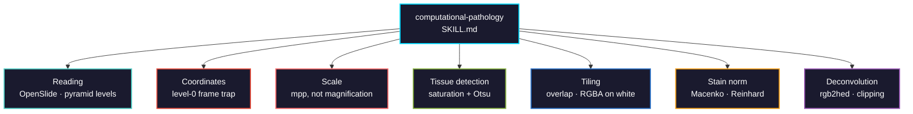

# computational-pathology

Whole-slide image processing for cancer histopathology: reading vendor formats, the coordinate and resolution semantics behind most WSI bugs, tissue detection, tile extraction, stain normalization, and H&E colour deconvolution.

> **Part 1 of a multi-part skill.** This covers WSI processing. Feature extraction, slide-level analysis, and validation follow.



## Usage

```bash
pip install biomedical-ai-skills
biomedical-skills install computational-pathology
```

## The two bugs that cost the most time

**Coordinate frames.** `read_region(location, level, size)` takes `location` in the **level 0** frame and `size` in the **target level** frame — two frames in one call. The result has the right shape and the wrong content, and it only shows up once you move off level 0, so a level-0 prototype hides it.

**Magnification is not resolution.** "40x" is a nominal objective power that maps to roughly 0.23–0.28 µm/px depending on scanner. Tiles cut at "40x" from two scanners sit at different physical scales, and the model learns the scanner. Work in microns per pixel.

## What it gets right that is easy to get wrong

| | |
|---|---|
| `read_region` frames | `location` is level 0, `size` is the target level. Scale the location by `level_downsamples[level]` |
| `level_downsamples` | Floats such as **4.0000123**, not integers. Never pick a level with `==` |
| `get_best_level_for_downsample` | Errs toward **more** resolution. Read finer and resize down; never upscale |
| `openslide.mpp-x` | **Optional.** Absent on some slides. Flag them, don't default to 0.25 |
| Anisotropic pixels | mpp-x and mpp-y can differ. Check both |
| `bounds-*` | MIRAX slides store a small scan inside a large empty canvas |
| RGBA → RGB | `.convert("RGB")` composites onto **black**, turning unscanned area into dark tissue-coloured pixels. Composite onto white |
| Tissue detection | Threshold **saturation**, not intensity — glass is bright *and* unsaturated, while pale adipose is real signal |
| Otsu | Assumes a bimodal histogram. An all-tissue slide has no valley and Otsu splits noise |
| Tissue threshold | ">50% tissue" and ">10% tissue" are different datasets. Record the number |
| `staintools` | Last release **2019-04-11**, GitHub **archived** 2021-05-08. Use torchstain or HistomicsTK |
| Vahadane | **Not in torchstain** (Macenko, MultiMacenko, Reinhard only). Sparse NMF is HistomicsTK's `separate_stains_xu_snmf` |
| Stain reference tile | Every normalized value depends on it. Record it, reuse it across train and test |
| `rgb2hed` third channel | Always returns H, **E and DAB**. On H&E the DAB channel absorbs residual — it is not DAB positivity |
| `rgb2hed` round trip | Negatives are **clipped to zero**, so the inverse is exact only where nothing clipped |

## Measured: colour deconvolution clipping

`separate_stains` ends with `np.maximum(stains, 0)`. On scikit-image 0.26.0 with random RGB in [0.4, 0.9]:

| | |
|---|---|
| pixels with ≥1 clipped channel | **784 / 1024** |
| round-trip max error, unclipped | **1.1e-16** (exact) |
| round-trip max error, clipped | **6.1e-01** |

Real H&E mostly lies inside the stain cone and clips far less than random RGB, but the loss is silent either way.

## Install

```bash
pip install openslide-python openslide-bin
```

`openslide-python` is a **binding**, and its only dependency is Pillow. Without `openslide-bin` (or a system OpenSlide) the import fails at load time.

## Tool landscape (2026-08)

| Use | Tool | Status |
|-----|------|--------|
| Reading vendor formats | `openslide-python` 1.4.6 | maintained; needs `openslide-bin` 4.0.1.2 |
| Full pipeline | `tiatoolbox` 2.1.3 | maintained, Python 3.11–3.14 |
| Tiling and masks | `histolab` 0.7.0 | **capped at Python < 3.12**, last release 2024-02 |
| Alternative reader | `slideio` 2.8.1 | maintained |
| Tile server / multi-backend | `large-image` 1.35.2 | maintained |
| Stain deconvolution | `HistomicsTK` 1.4.0 | maintained (pushed 2026-08) |
| Stain normalization | `torchstain` 1.4.1 | maintained |
| Stain normalization | `staintools` 2.1.2 | **archived** — do not start new work on it |
