# computational-pathology

Whole-slide image processing and slide-level modelling for cancer histopathology: reading vendor formats, the coordinate and resolution semantics behind most WSI bugs, tissue detection, tile extraction, stain normalization, H&E colour deconvolution, pathology foundation models as tile encoders, multiple instance learning, cell segmentation, spatial statistics on cell positions, and integration with molecular data.

> **Parts 1–3 of a multi-part skill.** WSI processing, feature extraction, and slide-level analysis. Validation follows.

```mermaid
graph TD
    A["computational-pathology<br>SKILL.md"] --> B["Reading<br>OpenSlide · pyramid levels"]
    A --> C["Coordinates<br>level-0 frame trap"]
    A --> D["Scale<br>mpp, not magnification"]
    A --> E["Tissue detection<br>saturation + Otsu"]
    A --> F["Tiling<br>overlap · RGBA on white"]
    A --> G["Stain norm<br>Macenko · Reinhard"]
    A --> H["Deconvolution<br>rgb2hed · clipping"]
    A --> I["Tile encoders<br>UNI · CONCH · Phikon"]
    A --> J["MIL<br>attention · slide-level"]
    A --> K["Segmentation<br>StarDist · HoVer-Net"]
    A --> L["Spatial stats<br>Ripley · co-occurrence"]
    style A fill:#1a1a2e,stroke:#00d9ff,color:#fff,stroke-width:2px
    style B fill:#1a1a2e,stroke:#4ecdc4,color:#fff,stroke-width:2px
    style C fill:#1a1a2e,stroke:#e84d3c,color:#fff,stroke-width:2px
    style D fill:#1a1a2e,stroke:#ff6b6b,color:#fff,stroke-width:2px
    style E fill:#1a1a2e,stroke:#87b13f,color:#fff,stroke-width:2px
    style F fill:#1a1a2e,stroke:#276DC3,color:#fff,stroke-width:2px
    style G fill:#1a1a2e,stroke:#f39c12,color:#fff,stroke-width:2px
    style H fill:#1a1a2e,stroke:#9b59b6,color:#fff,stroke-width:2px
    style I fill:#1a1a2e,stroke:#1abc9c,color:#fff,stroke-width:2px
    style J fill:#1a1a2e,stroke:#e67e22,color:#fff,stroke-width:2px
    style K fill:#1a1a2e,stroke:#2ecc71,color:#fff,stroke-width:2px
    style L fill:#1a1a2e,stroke:#9b59b6,color:#fff,stroke-width:2px
```



## Usage

```bash
pip install biomedical-ai-skills
biomedical-skills install computational-pathology
```

## The two bugs that cost the most time

**Coordinate frames.** `read_region(location, level, size)` takes `location` in the **level 0** frame and `size` in the **target level** frame — two frames in one call. The result has the right shape and the wrong content, and it only shows up once you move off level 0, so a level-0 prototype hides it.

**Magnification is not resolution.** "40x" is a nominal objective power that maps to roughly 0.23–0.28 µm/px depending on scanner. Tiles cut at "40x" from two scanners sit at different physical scales, and the model learns the scanner. Work in microns per pixel.

**Splitting by tile.** Tiles from one slide are near-duplicates. A tile-level split lets the model memorise the slide and report near-perfect accuracy that collapses on new cases. Split by **patient**, and hold out a **site** when the cohort is multi-institutional.

## What it gets right that is easy to get wrong

| | |
|---|---|
| `read_region` frames | `location` is level 0, `size` is the target level. Scale the location by `level_downsamples[level]` |
| `level_downsamples` | Floats such as **4.0000123**, not integers. Never pick a level with `==` |
| `get_best_level_for_downsample` | Errs toward **more** resolution. Read finer and resize down; never upscale |
| `openslide.mpp-x` | **Optional.** Absent on some slides. Flag them, don't default to 0.25 |
| Anisotropic pixels | mpp-x and mpp-y can differ. Check both |
| `bounds-*` | MIRAX slides store a small scan inside a large empty canvas |
| RGBA → RGB | `.convert("RGB")` composites onto **black**, turning unscanned area into dark tissue-coloured pixels. Composite onto white |
| Tissue detection | Threshold **saturation**, not intensity — glass is bright *and* unsaturated, while pale adipose is real signal |
| Otsu | Assumes a bimodal histogram. An all-tissue slide has no valley and Otsu splits noise |
| Tissue threshold | ">50% tissue" and ">10% tissue" are different datasets. Record the number |
| `staintools` | Last release **2019-04-11**, GitHub **archived** 2021-05-08. Use torchstain or HistomicsTK |
| Vahadane | **Not in torchstain** (Macenko, MultiMacenko, Reinhard only). Sparse NMF is HistomicsTK's `separate_stains_xu_snmf` |
| Stain reference tile | Every normalized value depends on it. Record it, reuse it across train and test |
| `rgb2hed` third channel | Always returns H, **E and DAB**. On H&E the DAB channel absorbs residual — it is not DAB positivity |
| `rgb2hed` round trip | Negatives are **clipped to zero**, so the inverse is exact only where nothing clipped |
| Model gating | Nearly all pathology encoders are gated. `UNI` returns **HTTP 401** anonymously |
| CC-BY-NC-ND | UNI, UNI2-h, CONCH, Virchow2. **ND covers a fine-tuned checkpoint** |
| Preprocessing transform | Use the model's own via `timm.data.create_transform`. ImageNet constants degrade embeddings silently |
| Embedding dim | A model property (phikon 768, phikon-v2 1024). Read `model.num_features` |
| Tile-level splits | Tiles from one slide are near-duplicates. Split by **patient**, hold out a **site** |
| Attention weights | Not explanations. Unstable across seeds; report as hypotheses |
| Background tiles in a bag | Attention is a softmax, so background **dilutes** weight on informative tiles |
| `pip install stardist` | No deep-learning backend. TensorFlow comes via `csbdeep[tf]`; a bare install fails at `predict`, not install |
| StarDist input norm | Expects `csbdeep.utils.normalize` (percentile), not a 0–1 rescale |
| HoVer-Net | **git-only**, MIT, last pushed 2023-10. Cell types come from its training panel |
| Segmentation scale | Nuclei need ~0.25 µm/px. Report cells per **mm²**, not per tile |
| TLS ≠ lymphocyte-rich tile | Diffuse infiltration and an organised follicle differ in **organisation**, not count |
| Ripley over bounding box | CSR over a half-glass rectangle reports the tissue outline as clustering. Mask to tissue |
| squidpy | Spatial stats, but **Python ≥ 3.12** |
| Cells matched to spots | Adjacent sections don't share cells one-to-one. Integrate at the **region** level |
| Morphology vs expression | Tracks tumour **purity**, which drives bulk expression. Adjust for purity |

## Foundation models: access and licence, verified 2026-08

Nearly every pathology encoder is **gated** on HuggingFace. Proven anonymously:

```
MahmoodLab/UNI    config.json -> HTTP 401
owkin/phikon-v2   config.json -> HTTP 200
```

| Model | Gated | Licence | Kind |
|---|---|---|---|
| `MahmoodLab/UNI` | yes | **CC-BY-NC-ND-4.0** | vision |
| `MahmoodLab/UNI2-h` | yes | **CC-BY-NC-ND-4.0** | vision, larger |
| `MahmoodLab/CONCH` | yes | **CC-BY-NC-ND-4.0** | vision-language |
| `paige-ai/Virchow` | yes | Apache-2.0 | vision |
| `paige-ai/Virchow2` | yes | **CC-BY-NC-ND-4.0** | vision |
| `prov-gigapath/prov-gigapath` | yes | Apache-2.0 | tile + slide |
| `bioptimus/H-optimus-0` | yes | Apache-2.0 | vision |
| `owkin/phikon` | **no** | other | vision, 768-dim |
| `owkin/phikon-v2` | **no** | other | vision, 1024-dim |

**ND means no derivatives** — on a plain reading that covers a fine-tuned checkpoint. If you intend to fine-tune and release weights, or deploy commercially, the Apache-2.0 models are the ones that permit it. Prototype on the ungated Owkin models, then swap.

## Two install traps

**`pip install trident` installs an astrophysics package** for simulating UV observations. Mahmood Lab's pathology TRIDENT installs from its git repository.

**CTransPath requires a forked timm 0.5.4** distributed as a tarball on a Google Drive link; current timm is 1.0.28. Isolate it or pick another encoder.

## MIL framework licences

| Framework | Licence |
|---|---|
| CLAM | **GPL-3.0** — copyleft, check before embedding in a product |
| DSMIL | MIT |
| TransMIL | **none declared** — default copyright, reuse rights unclear |

## Measured: colour deconvolution clipping

`separate_stains` ends with `np.maximum(stains, 0)`. On scikit-image 0.26.0 with random RGB in [0.4, 0.9]:

| | |
|---|---|
| pixels with ≥1 clipped channel | **784 / 1024** |
| round-trip max error, unclipped | **1.1e-16** (exact) |
| round-trip max error, clipped | **6.1e-01** |

Real H&E mostly lies inside the stain cone and clips far less than random RGB, but the loss is silent either way.

## Install

```bash
pip install openslide-python openslide-bin
```

`openslide-python` is a **binding**, and its only dependency is Pillow. Without `openslide-bin` (or a system OpenSlide) the import fails at load time.

## Tool landscape (2026-08)

| Use | Tool | Status |
|-----|------|--------|
| Reading vendor formats | `openslide-python` 1.4.6 | maintained; needs `openslide-bin` 4.0.1.2 |
| Full pipeline | `tiatoolbox` 2.1.3 | maintained, Python 3.11–3.14 |
| Tiling and masks | `histolab` 0.7.0 | **capped at Python < 3.12**, last release 2024-02 |
| Alternative reader | `slideio` 2.8.1 | maintained |
| Tile server / multi-backend | `large-image` 1.35.2 | maintained |
| Stain deconvolution | `HistomicsTK` 1.4.0 | maintained (pushed 2026-08) |
| Stain normalization | `torchstain` 1.4.1 | maintained |
| Stain normalization | `staintools` 2.1.2 | **archived** — do not start new work on it |
| Tile encoder loading | `timm` 1.0.28 | maintained; use each model's own transform |
| Slide pipeline | `mahmoodlab/TRIDENT` | active (pushed 2026-08); **install from git, not PyPI** |
| MIL | `CLAM` / `DSMIL` / `TransMIL` | GPL-3.0 / MIT / **no licence declared** |
| Generic deep MIL | `torchmil` 1.0.2 | on PyPI |
| Nucleus segmentation (H&E) | `stardist` 0.9.2 | ships `2D_versatile_he`; needs `csbdeep[tf]` |
| Nuclei + cell type | `hover_net` | **git-only**, MIT, last pushed 2023-10 |
| Generalist segmentation | `cellpose` 4.2.1.1 / `instanseg-torch` 0.1.1 | maintained |
| Spatial statistics | `squidpy` 1.8.3 / `pointpats` 2.6.0 | maintained; Python ≥ 3.12 |
