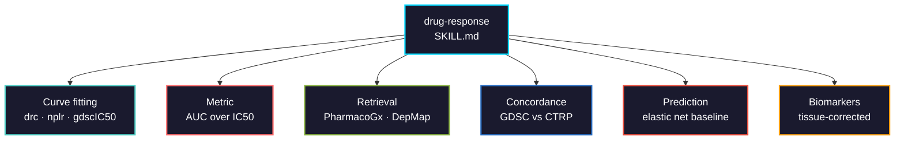

# drug-response

Dose-response modeling and drug sensitivity prediction in cancer cell lines: IC50/AUC curve fitting, GDSC/CTRP/PRISM retrieval, cross-dataset harmonization, and pharmacogenomic biomarker discovery.



## Usage

```bash
pip install biomedical-ai-skills
biomedical-skills install drug-response
```

## What it gets right that is easy to get wrong

| | |
|---|---|
| IC50 vs AUC | A drug plateauing at 60% viability has **no IC50** — pipelines substitute the max concentration, which is not a measurement. AUC is always defined and correlates better with clinical response |
| `drm()` convergence | It can return non-converged parameters with only a warning. Check the convergence code and refit failures |
| Concentration scale | Use `LL2.4` (log EC50) for concentrations spanning orders of magnitude, which every screen does |
| Asymptotes | Unconstrained, `drm()` fits negative viability or 130% upper asymptotes. Bound them to biology |
| GDSC reproduction | GDSC fits a *joint* model across cell lines (`gdscIC50`). Independent per-curve fits will not match its IC50 values |
| PharmacoGx source | The **CRAN** package is frozen at 1.1.6 (2016). The maintained one is on **Bioconductor** |
| cancerrxgene.org | The GDSC site currently returns **HTTP 410**. Retrieve GDSC data through PharmacoGx or DepMap |
| Published vs recomputed | Each source fit curves its own way — published IC50/AUC are **not comparable** across datasets. Use `*_recomputed` |
| AUC vs AAC | AAC = 1 − AUC. A sign flip silently inverts every result |
| Feature leakage | Selecting biomarker genes on the full dataset before CV leaks the test fold. Select inside each fold |
| Tissue confounding | A model can predict response by predicting lineage. Test across lineages |

## Validation

Tests in [`tests/`](tests/) run on simulated dose-response and prediction problems with a known ground truth, so no multi-gigabyte PharmacoSet download is needed. The curve test cross-checks against `drc` and `nplr` when installed.

**Executed 2026-08-16: 22 assertions, 0 failures** (R 4.5.1, drc 3.0.1, nplr 0.1.8, glmnet 4.1.10).

```bash
Rscript tests/run_all.R
```

Things the suite demonstrates rather than asserts:

- A plateauing curve (never below 60% viability) has **no observed IC50** — the function returns NA — while AUC (0.85) is defined. AAC = 1 − AUC
- `drc` returns ED50 = 0.278 for that plateau curve anyway, an **extrapolation**, not a measurement
- Selecting features before cross-validation reports r ≈ 0.82; nested selection reports r ≈ 0.35 on the same data
- A lineage-confounded model scores r ≈ 0.95 under random-fold CV and **collapses to negative** under leave-lineage-out

It also corrected the skill: `drc`'s convergence flag is a **logical** (`TRUE` = converged), not the optim `== 0` convention. The earlier text used the wrong check.

## Data source status (2026-08)

| Source | Status | Use |
|--------|--------|-----|
| DepMap | up (HTTP 200) | CCLE molecular, CRISPR dependency, PRISM drug screen |
| PharmacoGx (Bioconductor 3.16.0) | maintained | curated PharmacoSets, recomputed sensitivity |
| cancerrxgene.org (GDSC portal) | **HTTP 410** | do not hardcode; get GDSC via PharmacoGx/DepMap |
| PharmacoDB / ORCESTRA | up | cross-dataset query, versioned PharmacoSets |
| `drc` 3.0-1 | stale (2016) but standard | 4PL curve fitting |
| `nplr` 0.1-8 | maintained (2025) | robust alternative fitter |
