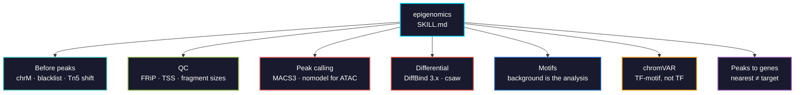

# epigenomics

ATAC-seq and ChIP-seq for chromatin accessibility and transcription factor binding: the filtering that precedes peak calling, ATAC-specific peak calling, differential binding and the DiffBind 3.x changes that silently alter results, motif enrichment, TF activity, and peak-to-gene assignment.



## Usage

```bash
pip install biomedical-ai-skills
biomedical-skills install epigenomics
```

## DiffBind 3.x returns different numbers than 2.x

Verified from the package's own NEWS — three changes that alter results **without erroring**:

| Change | Effect |
|---|---|
| `dba.count()` now **centres on summits by default** (401 bp intervals) | Every peak's width changes, so every count changes. Restore with `summits = FALSE` |
| **Modelling default changed** | Pre-3.0 methods kept for compatibility but no longer default. Reproduce old work with `dba.contrast(design = FALSE)` |
| **Normalization moved out of `dba.analyze()`** | `bSubControl`, `bFullLibrarySize`, `filter`, `filterFun` now live in `dba.normalize()` — silently lost otherwise |

A 2.x script runs fine on 3.x and gives different answers. That is worse than an error.

Two current issues in 3.22.x:

- **`bSubControl` was not preserved** from `dba.count()` before **3.22.2**, so analysis could silently fall back to control subtraction. Upgrade, or set it explicitly at every step.
- **`dba.plotProfile()` is disabled** as of 3.22.1 — it prints a notice and returns `NULL` invisibly because its backend (`profileplyr`) is uninstallable in current Bioconductor. Use deeptools.

## What it gets right that is easy to get wrong

| | |
|---|---|
| Mitochondrial reads | chrM is nucleosome-free; routinely **20–50%** of an ATAC library. Distorts normalization if left in |
| ENCODE blacklist | Artefact regions become confident peaks in *every* sample |
| Tn5 shift | +4 / −5. Tn5 inserts as a dimer spanning 9 bp, so cut sites are offset from read starts |
| FRiP / TSS enrichment | A failed library still yields peaks you can plot. A flat TSS profile is a failed experiment |
| `macs2` | Development moved to **MACS3** (3.0.4). MACS2's last release was 2023 |
| ATAC peak model | MACS's paired-peak model assumes point-source ChIP structure ATAC lacks. Use `--nomodel` |
| `BAMPE` + `--shift` | Double-corrects — fragments are already correctly placed. Pick one convention |
| Broad marks | H3K27me3 / H3K36me3 called narrow fragment into many small peaks. Use `--broad` |
| Motif background | GC- and accessibility-matched, or GC-rich motifs win regardless of biology |
| chromVAR output | **TF-motif** activity, not TF. Family members sharing a motif are indistinguishable |
| JASPAR version | Matrices are revised between releases; the same peaks give different enrichment |
| Nearest TSS | An assumption, not a result. Enhancers routinely skip the nearest gene |
| ATAC + RNA across studies | The correlation measures study differences as much as regulation |

## Verified 2026-08

| Tool | Version | Note |
|---|---|---|
| `MACS3` | 3.0.4 (2026-02) | current; MACS2 2.2.9.1 last released 2023-07 |
| `DiffBind` | 3.22.2 | see the version changes above |
| `csaw` | 1.46.0 | window-based alternative, avoids peak-set bias |
| `chromVAR` | 1.34.1 | TF-motif deviations |
| `ChIPseeker` | 1.48.0 | peak annotation |
| `motifmatchr` / `TFBSTools` | 1.34.0 / 1.50.0 | motif scanning |
| `rGREAT` | 2.14.0 | regulatory-domain enrichment |
| `deeptools` | 3.5.6 | coverage and profile plots |
| JASPAR | **2024 is the latest** | JASPAR2026 does not exist |
