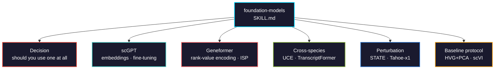

# foundation-models

When to use scGPT, Geneformer, UCE, and the perturbation models on single-cell data, and when a linear baseline beats them.



## Usage

```bash
# Claude Code
cp SKILL.md your-project/.claude/skills/

# Cursor
cp SKILL.md your-project/.cursor/skills/
```

## What this skill is for

Most material on single-cell foundation models is written by the people who built them. This one is written from the benchmark literature, which reaches a different conclusion: they are representation-strong and prediction-weak, and for the common tasks a well-tuned baseline wins.

The skill exists to answer two questions:

1. **Should you use one at all?** Usually no, and the table says when yes.
2. **If yes, how do you avoid the silent failures?** Raw-counts-only tokenization, vocabulary mismatch, checkpoint ambiguity, pretraining contamination.

## The decision, in short

| Task | Use |
|------|-----|
| Human cell type annotation | CellTypist |
| Integration + label transfer | scANVI / scVI |
| Clustering, batch correction | HVG + PCA, Harmony, scVI |
| **<1000 labels + large unlabeled set** | **fine-tuned scGPT or Geneformer** |
| **Cross-species** | **TranscriptFormer, UCE** |
| **Spatial + dissociated jointly** | **Nicheformer** |
| **Combinatorial perturbations** | **STATE, Tahoe-x1** |
| **Cancer / drug response** | **Tahoe-x1, Geneformer CLcancer** |

## Validation

Tests in [`tests/`](tests/) establish the baseline a foundation model has to beat, and verify the two input contracts that fail silently.

**Executed 2026-08-15: 32 assertions, 0 failures** (scanpy 1.11.5, scikit-learn 1.8.0).

```bash
python tests/run_all.py
```

| Measured on PBMC 3k | ARI | NMI |
|---|---|---|
| HVG + PCA, 30 PCs | **0.879** | **0.861** |
| All genes + PCA | 0.547 | 0.715 |

HVG selection alone is worth **0.332 ARI** — more than most model choices. That 0.879 is the number a zero-shot embedding has to clear to earn its compute.

The suite also demonstrates both silent failures:

- **Log-normalizing before Geneformer** changes the token order for **100% of cells**, with a mean Spearman of **0.008** against the correct order. No error is raised.
- **Passing Ensembl IDs to a symbol vocabulary** matches **0 of 32,738 genes**. The model still returns embeddings.

## Non-negotiable protocol

Run HVG+PCA and scVI as baselines in the same script. Check whether your dataset is in the pretraining corpus. Report DE-based metrics for perturbation, never all-genes Pearson alone. Fix seeds and report variance.
