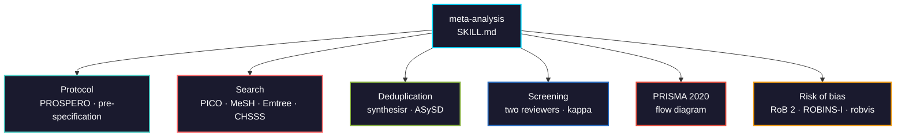

# meta-analysis

Systematic review and meta-analysis for clinical and preclinical evidence. This part covers everything up to synthesis: protocol, search, screening, PRISMA 2020 flow diagrams, extraction, and risk of bias.



## Usage

```bash
pip install biomedical-ai-skills
biomedical-skills install meta-analysis

# or copy directly
cp SKILL.md your-project/.claude/skills/meta-analysis/
```

## What it gets right that is easy to get wrong

| | |
|---|---|
| Search construction | Search P AND I only. Adding an outcome block silently drops eligible studies, because outcomes are poorly indexed |
| Animal exclusion | `NOT (animals[mh] NOT humans[mh])`, not `NOT animals[mh]` — the naive form removes human studies that also used animal models |
| Studies vs reports | One trial with a primary paper, a follow-up, and an abstract is **one study, three reports**. Conflating them double-counts patients |
| RoB 2 granularity | Per outcome, not per study. A trial can be low risk for survival and high risk for an unblinded response endpoint |
| ROBINS-I version | V2 was posted 2025-11-20 but is still a **draft** and subject to change. Use the 2016 version for publication |
| Overall RoB judgement | The worst domain, never an average |
| Newcastle-Ottawa | Produces a score, and Cochrane advises against scoring. Pair with ROBINS-I rather than replacing it |

## Package landscape

| Use | Package | Status |
|-----|---------|--------|
| Flow diagrams | `PRISMA2020` 1.1.4 | maintained |
| Risk of bias plots | `robvis` 0.3.1 | maintained on CRAN; the hosted web app is not |
| Import and dedup | `synthesisr` 0.4.1 | maintained — replaces `revtools`, stale since 2019 |
| Agreement | `irr` 0.85 | maintained |
| PubMed access | `rentrez` 1.2.4 | maintained |
| Effect sizes and models | `metafor` 5.0-1 | maintained (used in later parts) |
