# meta-analysis

Systematic review and meta-analysis for clinical and preclinical evidence: protocol, search, screening, PRISMA 2020 flow diagrams, risk of bias, pooling, small-study effects, sensitivity diagnostics, network meta-analysis, and certainty rating.

```mermaid
graph TD
    A["meta-analysis<br>SKILL.md"] --> B["Protocol<br>PROSPERO · pre-specification"]
    A --> C["Search<br>PICO · MeSH · Emtree · CHSSS"]
    A --> D["Deduplication<br>synthesisr · ASySD"]
    A --> E["Screening<br>two reviewers · kappa"]
    A --> F["PRISMA 2020<br>flow diagram"]
    A --> G["Risk of bias<br>RoB 2 · ROBINS-I · robvis"]
    A --> H["Pooling<br>metafor · REML · Knapp-Hartung"]
    A --> I["Heterogeneity<br>tau² · I² · prediction interval"]
    A --> J["Small-study effects<br>Egger · selection models"]
    A --> K["Network MA<br>netmeta · transitivity · CINeMA"]
    style A fill:#1a1a2e,stroke:#00d9ff,color:#fff,stroke-width:2px
    style B fill:#1a1a2e,stroke:#4ecdc4,color:#fff,stroke-width:2px
    style C fill:#1a1a2e,stroke:#ff6b6b,color:#fff,stroke-width:2px
    style D fill:#1a1a2e,stroke:#87b13f,color:#fff,stroke-width:2px
    style E fill:#1a1a2e,stroke:#276DC3,color:#fff,stroke-width:2px
    style F fill:#1a1a2e,stroke:#e84d3c,color:#fff,stroke-width:2px
    style G fill:#1a1a2e,stroke:#f39c12,color:#fff,stroke-width:2px
    style H fill:#1a1a2e,stroke:#9b59b6,color:#fff,stroke-width:2px
    style I fill:#1a1a2e,stroke:#1abc9c,color:#fff,stroke-width:2px
    style J fill:#1a1a2e,stroke:#e67e22,color:#fff,stroke-width:2px
    style K fill:#1a1a2e,stroke:#00d9ff,color:#fff,stroke-width:2px
```



## Usage

```bash
pip install biomedical-ai-skills
biomedical-skills install meta-analysis

# or copy directly
cp SKILL.md your-project/.claude/skills/meta-analysis/
```

## What it gets right that is easy to get wrong

| | |
|---|---|
| Search construction | Search P AND I only. Adding an outcome block silently drops eligible studies, because outcomes are poorly indexed |
| Animal exclusion | `NOT (animals[mh] NOT humans[mh])`, not `NOT animals[mh]` — the naive form removes human studies that also used animal models |
| Studies vs reports | One trial with a primary paper, a follow-up, and an abstract is **one study, three reports**. Conflating them double-counts patients |
| RoB 2 granularity | Per outcome, not per study. A trial can be low risk for survival and high risk for an unblinded response endpoint |
| ROBINS-I version | V2 was posted 2025-11-20 but is still a **draft** and subject to change. Use the 2016 version for publication |
| Overall RoB judgement | The worst domain, never an average |
| Newcastle-Ottawa | Produces a score, and Cochrane advises against scoring. Pair with ROBINS-I rather than replacing it |
| metafor 4.x → 5.x | Bias correction became the `escalc()` default for `ROM`/`CVR`. Old code runs fine and returns **different numbers** |
| Knapp-Hartung | `test = "knha"` is **not** the default. Without it, intervals are too narrow with few studies |
| `EE` vs `FE` | Identical numbers, different claims. EE assumes one true effect; FE restricts inference to the included studies |
| I² | The *proportion* of variability from heterogeneity, not its amount. It rises with study size at constant tau² |
| Subgroups | Test the QM interaction. Comparing separate subgroup p-values is not a comparison |
| Egger's test | Needs **k ≥ 10**. Below that it cannot separate asymmetry from chance |
| Funnel asymmetry | Means *small-study effects*, not publication bias. Heterogeneity and study quality produce the same picture |
| Trim-and-fill | Cochrane: interpret corrected estimates "with great caution". A sensitivity analysis, not the result |
| `pairwise()` | Lives in **meta**, not netmeta. It builds the correlation structure multi-arm trials require |
| Transitivity | A clinical judgement made *before* fitting. Inconsistency tests are underpowered and cannot substitute |
| SUCRA / P-scores | A treatment can rank first on one small trial. Never report a rank without its effect estimate |
| CINeMA | A **web application**, not an R package. GRADE does not extend cleanly to networks |

## Validation

Tests in [`tests/`](tests/) run against `metadat` and `netmeta` shipped datasets. Nothing is downloaded, so the suite finishes in under a minute offline.

**Executed 2026-08-12: 81 assertions, 0 failures** (R 4.5.1, metafor 4.8.0, netmeta 3.2.0).

```bash
Rscript tests/run_all.R
```

Three things the suite demonstrates rather than asserts:

- `method="EE"` and `method="FE"` return **identical** numbers, to 1e-12
- The prediction interval (−1.87, 0.44) **crosses zero** while the CI (−1.07, −0.36) does not
- Dividing every sampling variance by 4 raises I² from 92.2% to 98.4% at unchanged tau², because I² is a proportion of variability rather than an amount of heterogeneity

It also detects the metafor 4.x/5.x boundary directly: on 4.x, `escalc(measure="ROM", correct=)` makes no difference; from 5.0 it does.

## Package landscape

| Use | Package | Status |
|-----|---------|--------|
| Flow diagrams | `PRISMA2020` 1.1.4 | maintained |
| Risk of bias plots | `robvis` 0.3.1 | maintained on CRAN; the hosted web app is not |
| Import and dedup | `synthesisr` 0.4.1 | maintained — replaces `revtools`, stale since 2019 |
| Agreement | `irr` 0.85 | maintained |
| PubMed access | `rentrez` 1.2.4 | maintained |
| Effect sizes and models | `metafor` 5.0-1 | maintained |
| Network meta-analysis | `netmeta` 3.6-1 | maintained |
| Bias sensitivity | `metasens` 1.5-3 | maintained (Copas, limit meta-analysis) |
| Bayesian NMA | `gemtc` 1.1-1 / `multinma` 0.9.1 | maintained |
