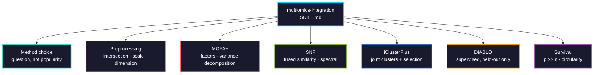

# multiomics-integration

Joint analysis of two or more molecular layers on the same samples: method selection, the preprocessing that decides whether integration works at all, MOFA+ factor analysis, similarity network fusion, joint clustering, supervised integration, and survival models on integrated features.



## Usage

```bash
pip install biomedical-ai-skills
biomedical-skills install multiomics-integration
```

## Pick the method from the question

```
outcome to predict?          -> DIABLO (mixOmics), supervised
interpretable factors?       -> MOFA+, tolerates missing views
patient clusters?            -> SNF, fuses similarity networks
clusters + feature selection -> iClusterPlus, slow, needs tuning
```

## What it gets right that is easy to get wrong

| | |
|---|---|
| mixOmics source | **CRAN is 6.3.2 from 2018**; Bioconductor is 6.36.0. `install.packages()` gives an eight-year-old API |
| `run_mofa()` | `use_basilisk` defaults to **FALSE**, so it uses whatever Python reticulate finds. Without `mofapy2` there, training dies with a Python import error |
| MOFA2 is Python | The R package is a front end over `mofapy2`; its managed env pins **numpy 1.26.4** |
| Sample intersection | 500 + 480 + 90 integrates to **90**. Report it — that is the study you ran |
| View scaling | log-CPM, M-values and log-ratios have different ranges. Variance-based methods follow the biggest numbers |
| Feature imbalance | 20,000 genes vs 100 proteins. Scaling does not fix this; select per view and report N |
| Beta vs M-values | Beta is bounded and heteroscedastic, so variance ranking picks intermediate-methylation probes regardless of biology |
| `num_factors` | An **upper bound**, not a target. MOFA prunes; getting 8 of 15 is correct |
| "Multi-omics factor" | A factor loading on one view is that view's internal structure. Read the variance decomposition |
| MOFA Factor 1 | Usually **purity, sex or batch** in tumour data. Correlate against covariates before claiming biology |
| SNF `K = 20` | A neighbourhood size. On 60 samples that is a third of the cohort — the fused network collapses |
| SNF output | A similarity matrix, **not clusters**. The count is your choice and moves with K and sigma |
| iClusterPlus types | Binary mutation data declared gaussian runs fine and fits nonsense |
| DIABLO performance | It selects features using Y. Training performance is not evidence — hold out, select inside the fold |
| Cluster survival tests | Testing survival across clusters on the samples that defined them is circular |

## Verified 2026-08

| Package | Version | Note |
|---|---|---|
| `MOFA2` | 1.22.0 (Bioconductor) | actively maintained; Python engine via reticulate |
| `iClusterPlus` | 1.48.0 (Bioconductor) | available, no deprecation notice |
| `mixOmics` | **6.36.0 Bioconductor** / 6.3.2 CRAN (2018) | use Bioconductor |
| `SNFtool` | 2.3.1 | **last released 2021-06-11** — stable but unmaintained |
| `glmnet` | 5.0 | major version (2026-05); pin it |
| `survival` | 3.8-11 | current |
| `mofapy2` | 0.7.5 | the actual MOFA solver |

Signatures read from source: `SNF(Wall, K = 20, t = 20)`, `affinityMatrix(diff, K = 20, sigma = 0.5)`, `run_mofa(object, outfile = NULL, save_data = TRUE, use_basilisk = FALSE)`.
