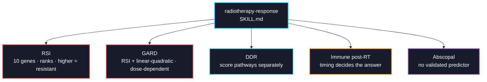

# radiotherapy-response

Genomic predictors of radiation response: DNA damage repair pathway profiling, the Radiosensitivity Index and the Genomic-Adjusted Radiation Dose built on it, post-irradiation immune signatures, and an honest account of the abscopal effect.



## Usage

```bash
pip install biomedical-ai-skills
biomedical-skills install radiotherapy-response
```

## No package implements RSI or GARD

Checked CRAN, Bioconductor and PyPI — there is no maintained implementation. You write the model yourself from the publication, so the gene list, coefficients and rank transform are your responsibility. The skill writes the exact model out for that reason.

```
Genes:  AR, JUN, STAT1, PRRT2, RELA, ABL1, SUMO1, CDK1, HDAC9, IRF1

RSI = -0.0098009*AR +0.0128283*JUN +0.0254552*STAT1 -0.0017589*PRRT2
      -0.0038171*RELA +0.1070213*ABL1 -0.0002509*SUMO1 -0.0092431*CDK1
      -0.0204469*HDAC9 -0.0441683*IRF1
```

## The two errors that invert the result

**The inputs are ranks, not expression values.** The coefficients were fitted on within-sample ranks — that transform is what makes the score portable across platforms. Feeding log-TPM produces a number on a different scale that is not RSI.

**Higher RSI means more radio*resistant*.** The name says "radiosensitivity index" and the direction is the opposite of what it suggests: RSI predicts SF₂, the surviving fraction at 2 Gy, so high means more cells survive. Same class of error as reading AAC for AUC.

And a third that looks fine in the output: **rank across the whole transcriptome, then take the 10 genes.** Ranking only within the ten gives every sample the values 1–10 and destroys the signal.

## What it gets right that is easy to get wrong

| | |
|---|---|
| RSI inputs | **Ranks**, not expression. Rank across the transcriptome, then subset |
| RSI direction | **Higher = resistant.** Put it in the column name |
| Missing gene | The model has ten terms and no defined behaviour with nine. Report, don't drop |
| GARD | Dose-**dependent**. Meaningless without total dose and fractionation |
| α/β ratio | An assumption (≈10 tumour, ≈3 late-responding normal tissue), not a measurement |
| Dose adjustment | **Investigational and contested** — a pan-cancer analysis argues RSI is unfit for it. Report the score, not a prescription |
| DDR | Not one pathway. HR deficiency sensitizes to radiation; MMR deficiency drives MSI instead |
| `msigdbr` args | `category`/`subcategory` renamed to `collection`/`subcollection` |
| `msigdbr` versions | **Calendar versioned** now (10.0.2 → 24.1.0 → 26.1.1), not semantic |
| Post-RT biopsy timing | The immune response is transient; direction depends on when you sampled |
| Post-RT tissue | Contains fibrosis, necrosis and treatment effect — change may be composition, not regulation |
| Abscopal | **No validated biomarker panel exists.** Mechanistic correlates are mechanistic, not predictive |

## Verified 2026-08

| Tool | Version | Note |
|---|---|---|
| `RadioGx` | 2.16.0 (Bioconductor) | radiation pharmacogenomics data; **not** an RSI implementation |
| `msigdbr` | 26.1.1 | calendar versioning against the MSigDB release year |
| RSI / GARD | — | **no implementation on CRAN, Bioconductor or PyPI** |

RSI was trained in 48 cancer cell lines against survival fraction at 2 Gy. GARD combines it with the linear-quadratic model to give a dose-dependent estimate.
