# single-cell-atlas

Full single-cell RNA-seq pipeline from raw counts to biological interpretation: QC, normalization, integration, clustering, annotation, pseudobulk DE, trajectory, cell-cell communication, and TF activity. Dual-language: Seurat v5 (R) and scanpy (Python).

```mermaid
graph TD
    A["single-cell-atlas<br>SKILL.md"] --> B["QC filtering<br>MAD-based thresholds"]
    A --> C["Doublet detection<br>scDblFinder · Scrublet"]
    A --> D["Normalization<br>SCTransform v2 · scran"]
    A --> E["Integration<br>Harmony · scVI · CCA"]
    A --> F["Clustering & annotation<br>Leiden · CellTypist · scType"]
    A --> G["Pseudobulk DE<br>DESeq2 · decoupleR"]
    A --> H["Trajectory<br>PAGA · Monocle3 · scVelo"]
    A --> I["Communication & TF<br>CellChat · LIANA+ · decoupleR"]
    style A fill:#1a1a2e,stroke:#00d9ff,color:#fff,stroke-width:2px
    style B fill:#1a1a2e,stroke:#4ecdc4,color:#fff,stroke-width:2px
    style C fill:#1a1a2e,stroke:#ff6b6b,color:#fff,stroke-width:2px
    style D fill:#1a1a2e,stroke:#87b13f,color:#fff,stroke-width:2px
    style E fill:#1a1a2e,stroke:#276DC3,color:#fff,stroke-width:2px
    style F fill:#1a1a2e,stroke:#e84d3c,color:#fff,stroke-width:2px
    style G fill:#1a1a2e,stroke:#f39c12,color:#fff,stroke-width:2px
    style H fill:#1a1a2e,stroke:#9b59b6,color:#fff,stroke-width:2px
    style I fill:#1a1a2e,stroke:#1abc9c,color:#fff,stroke-width:2px
```



## Usage

```bash
# Claude Code
cp SKILL.md your-project/.claude/skills/

# Cursor
cp SKILL.md your-project/.cursor/skills/
```

## Validation

Tests in [`tests/`](tests/) run against 10x PBMC 3k and Kang et al. 2018 (GSE96583):

- QC metrics, filter cascade (2,700 raw to 2,638 after standard QC), MAD filtering, doublet rate, HVG selection
- Cluster count depends on `n_pcs` as much as on resolution: resolution 0.5 gives 9 clusters at 10 PCs and 6-7 at 40 PCs
- Marker specificity, including the markers that misfire (LYZ, NKG7, CD14)
- Harmony on 8 donors: batch mixing must improve *and* cell types must survive

```bash
python tests/run_all.py             # all tests
python tests/run_all.py qc          # QC only
```

## Languages covered

| Step | R (Seurat v5) | Python (scanpy) |
|------|---------------|-----------------|
| QC metrics | `PercentageFeatureSet()` | `sc.pp.calculate_qc_metrics()` |
| MAD filtering | Manual or `scater::isOutlier()` | Manual MAD computation |
| Doublets | `scDblFinder()` | `sc.pp.scrublet()` |
| Normalization | `SCTransform()` or `NormalizeData()` | `sc.pp.normalize_total()` + `log1p()` |
| Feature selection | `FindVariableFeatures()` | `sc.pp.highly_variable_genes()` |
| Integration | `IntegrateLayers()` / `RunHarmony()` | `harmony_integrate()` / scVI |
| Clustering | `FindClusters(algorithm=4)` | `sc.tl.leiden()` |
| Annotation | scType | CellTypist |
| Pseudobulk DE | `scuttle::aggregateAcrossCells()` + DESeq2 | `dc.pp.pseudobulk()` + PyDESeq2 |
| Trajectory | `monocle3::learn_graph()` | `sc.tl.paga()` / `sc.tl.dpt()` / scVelo |
| Communication | `CellChat` | `li.mt.rank_aggregate()` |
| TF activity | `decoupleR::run_ulm()` | `dc.run_ulm()` + CollecTRI |
