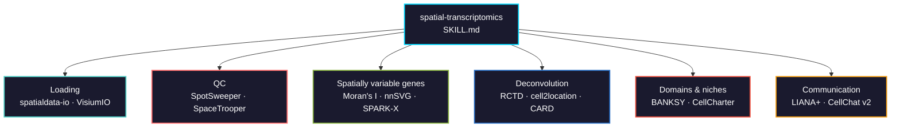

# spatial-transcriptomics

Spatially resolved transcriptomics across sequencing-based (Visium, Visium HD, Slide-seq, Stereo-seq) and imaging-based (Xenium, MERSCOPE, CosMx) platforms. Dual-language: Python (squidpy/SpatialData) and R (SpatialExperiment/Seurat v5).



## Usage

```bash
# Claude Code
cp SKILL.md your-project/.claude/skills/

# Cursor
cp SKILL.md your-project/.cursor/skills/
```

## The distinction that drives everything

| | Sequencing-based | Imaging-based |
|---|---|---|
| Platforms | Visium, Visium HD, Slide-seq, Stereo-seq | Xenium, MERSCOPE, CosMx |
| Resolution | 55 um spots to 2 um bins | single cell / subcellular |
| Transcriptome | whole | targeted panel (500-5,000 genes) |
| Spots hold | 1-10 cells | one cell |
| You need | **deconvolution** | **segmentation + cell typing** |
| Dominant error | reference mismatch | segmentation |

## Validation

Tests in [`tests/`](tests/) run against public 10x Visium mouse brain and an IMC dataset:

- Graph builders (kNN, Delaunay, radius) differ in degree and in the enrichment they produce
- Visium loading, spatial coordinates, spot-level QC, spatial autocorrelation of depth
- Moran's I bounds, anatomically restricted genes outranking housekeeping genes

```bash
python tests/run_all.py             # all tests
python tests/run_all.py neighbors   # cheapest, 1.6 MB download
```

## Languages covered

| Step | Python | R |
|------|--------|---|
| Visium loading | `squidpy.read.visium()` | `VisiumIO::TENxVisium()` |
| Visium HD | `spatialdata_io.visium_hd()` | `VisiumIO::TENxVisiumHD()` |
| Xenium | `spatialdata_io.xenium()` | `XeniumIO::TENxXenium()` |
| Spatial QC | `squidpy.experimental.im.qc_image()` | `SpotSweeper` / `SpaceTrooper` |
| SVGs | `sq.gr.spatial_autocorr()` | `nnSVG()` |
| Deconvolution | `cell2location` | `spacexr` (RCTD), `SPOTlight` |
| Domains | `cc.tl.ClusterAutoK()` | `Banksy::clusterBanksy()` |
| Communication | `li.mt.bivariate()` | `CellChat` spatial mode |
