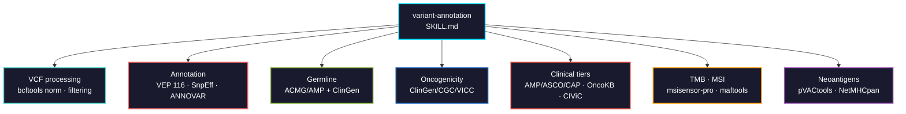

# variant-annotation

Annotation and clinical interpretation of DNA variants in cancer: VCF normalization, functional annotation, germline and somatic classification, TMB, MSI, and neoantigen prediction.



## Usage

```bash
pip install biomedical-ai-skills
biomedical-skills install variant-annotation
```

## Three frameworks, not one

The distinction most reports get wrong:

| Framework | Question | Applies to |
|---|---|---|
| **ACMG/AMP 2015** | Does this inherited variant cause disease? | germline only |
| **ClinGen/CGC/VICC 2022** | Is this variant driving the cancer? | somatic oncogenicity |
| **AMP/ASCO/CAP 2017** | Does it change management? | somatic tiers, per tumour type |

Oncogenicity and clinical significance are **different axes**. KRAS G12D is unambiguously oncogenic and can still be Tier III where nothing acts on it. ClinGen's own guidance is to apply both somatic frameworks, not choose between them.

## What it gets right that is easy to get wrong

| | |
|---|---|
| Normalization | `bcftools norm -m -any -f ref` **before** annotating. Un-normalized records fail knowledgebase lookups silently — the variant reads as absent, not as an error |
| ACMG on somatic variants | The criteria assume inheritance, segregation, and population frequency as benign evidence. None transfers |
| Tier without tumour type | BRAF V600E is Tier IA in melanoma, Tier IIC in colorectal. The tier is a property of the variant *in a context* |
| Tumour suppressor vs oncogene | A truncating variant is strong oncogenicity evidence in a tumour suppressor, uninformative in an oncogene |
| `PM2` strength | ClinGen recalibrated absence/rarity to **supporting**, not moderate |
| Points-based system | **Endorsed** by ClinGen, not mandated. ACMG/AMP 2015 plus criterion refinements is still the standard |
| Global vs popmax AF | 0.1% globally can be 4% in one ancestry group. Using global AF is how VUS accumulate in under-represented populations |
| TMB across assays | Numerator rules, denominators and germline filtering all differ by vendor. The 10 mut/Mb cutoff was validated on one assay |
| `maftools::tmb()` | The default `captureSize` is not your panel, and it scales every value linearly |
| MSI percentage | Report the locus count with it. 20% of 15 loci is not 20% of 2000 |
| `msisensor` | The original ding-lab repository is **archived**. Use msisensor-pro or msisensor2 |
| Binding vs immunogenicity | Most predicted binders provoke no T cell response. Filter on expression and treat output as hypotheses |

## Tool landscape

| Use | Tool | Status (2026-08) |
|-----|------|------------------|
| VCF manipulation | `bcftools` 1.24 | current |
| Annotation | Ensembl VEP **116.1** | current, updated with each Ensembl release |
| Annotation | SnpEff 5.4c | maintained |
| Annotation | ANNOVAR | distributed; databases update on their own schedule |
| MAF / TMB | `maftools` 2.28.0 | maintained |
| VCF in R | `VariantAnnotation` 1.58.0 | maintained |
| MSI | `msisensor-pro` 1.3.0 | current choice |
| MSI | `msisensor` | **archived** |
| Neoantigens | `pVACtools` 7.1.2 | very active |
